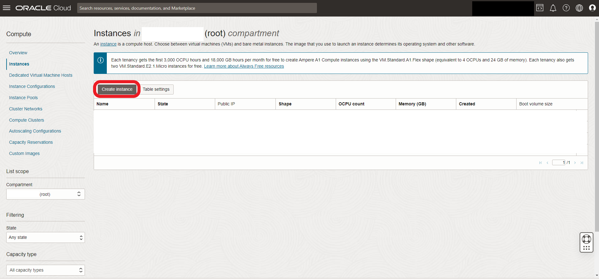

# ☁ Oracle Cloud


**Please note:** OCI does not support this documentation in any way, financial or otherwise.


## OCI Always-Free compute resources

Oracle provides users with Always-Free resources, including Arm Ampere A1 Compute: Arm-based Ampere A1 cores and 24 GB of memory usable as 1 VM or up to 4 VMs (3,000 OCPU hours and 18,000 GB hours per month).

To start using any of these resources, [sign-up here](https://signup.cloud.oracle.com/).&#x20;

## Provisioning your instances

Sign into your account and navigate to **Compute > Instances**:

<figure><figcaption></figcaption></figure>

**Choose your compartment** (you should have the _root_ one, created on sign-up):

<figure><figcaption></figcaption></figure>

Your compute console will look slightly different: I have removed info regarding my account to avoid any confusion. Click **Create Instance**:

<figure><figcaption></figcaption></figure>
