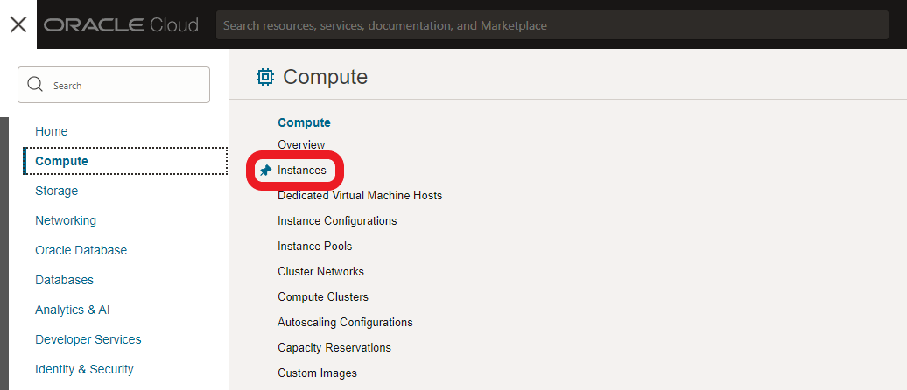
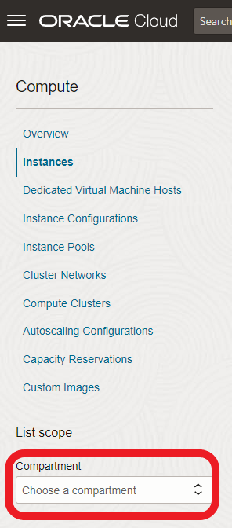
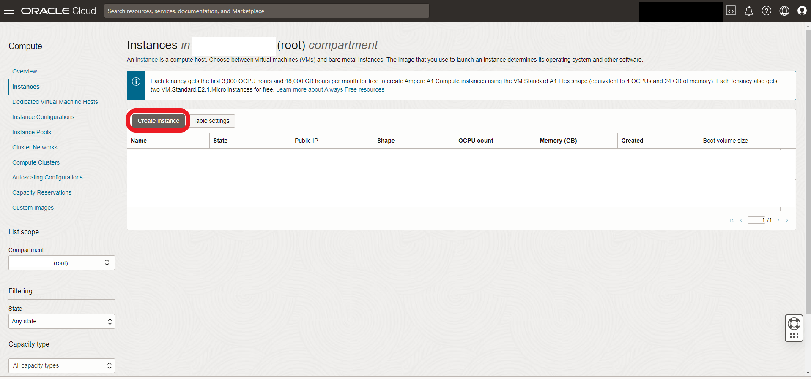

# ☁ Provisioning your instances


**Please note:** OCI does not support this documentation in any way, financial or otherwise.


Sign into your account and navigate to **Compute > Instances**:

<figure><figcaption></figcaption></figure>

**Choose your compartment** (you should have the _root_ one, created on sign-up):

<figure><figcaption></figcaption></figure>

Your compute console will look slightly different: I have removed info regarding my account to avoid any confusion. Click **Create Instance**:

<figure><figcaption></figcaption></figure>
