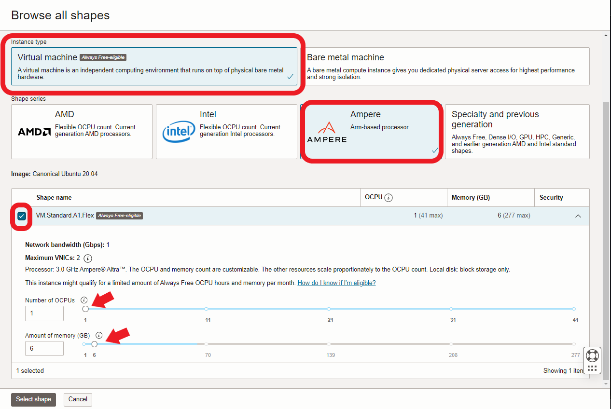
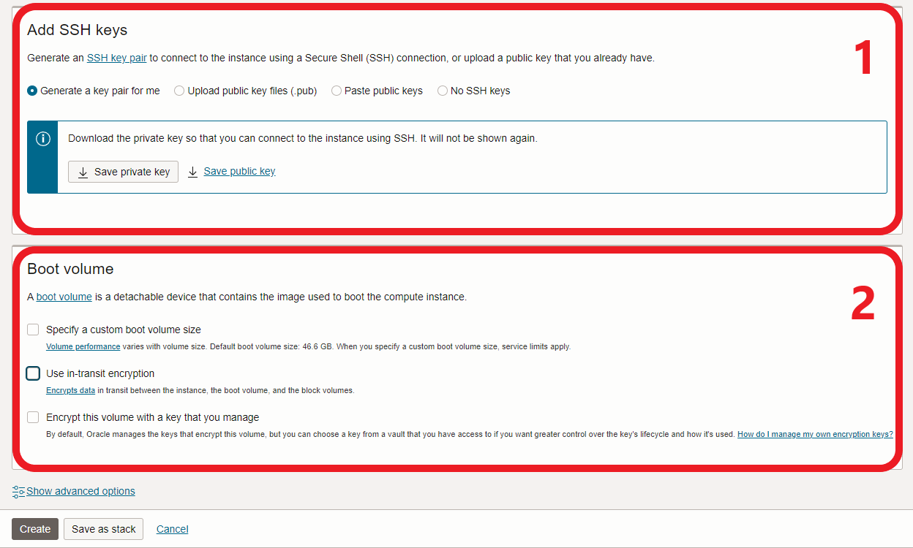

# ☁ Provisioning your instances


**Please note:** OCI does not support this documentation in any way, financial or otherwise.


Sign into your account and navigate to **Compute > Instances**:

<figure><figcaption></figcaption></figure>

**Choose your compartment** (you should have the _root_ one, created on sign-up):

<figure><figcaption></figcaption></figure>

Your compute console will look slightly different: I have removed info regarding my account to avoid any confusion. Click **Create Instance**:

<figure><figcaption></figcaption></figure>

First, give your instance a meaningful **name** (eg Preview-Relay) and then click **Edit** on **Image and Shape:**

<figure><figcaption></figcaption></figure>

**Change Image** to choose you favourite Linux flavour (Ubuntu 20.04 in this example) and then **Change Shape** to create a Standard VM (A1.Flex) with 1 CPU and 6 GB of RAM:&#x20;

<figure><figcaption></figcaption></figure>

 

<figure><figcaption></figcaption></figure>

 

<figure><figcaption></figcaption></figure>


You can leave the networking options set to default (**Primary and Secondary VNIC**)


Let OCI **generate a key-pair for you** (you will be changing this later anyway) and set your desired **boot disk** preferences (50 GB should suffice to start):

<figure><figcaption></figcaption></figure>


If you already have keys that you'd rather use, go ahead. The one OCI generates will be throw-away anyway, as we'll be making new keys.&#x20;



**Success:** click on **Create** and wait for the your new instance to provision.

