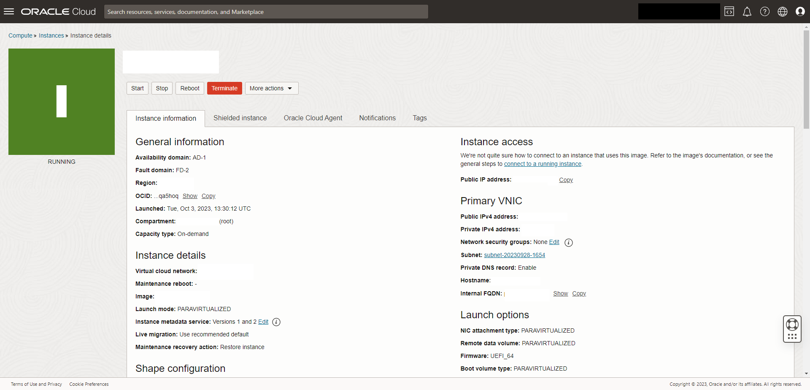

# 🗝 Change key and ssh port

From the **OCI control panel** navigate to **Compute > Instances** and **select your instance**. You should see something like this:

<figure><figcaption></figcaption></figure>


**WIP**

