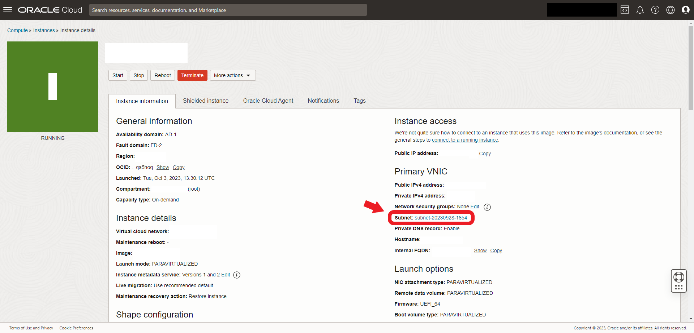
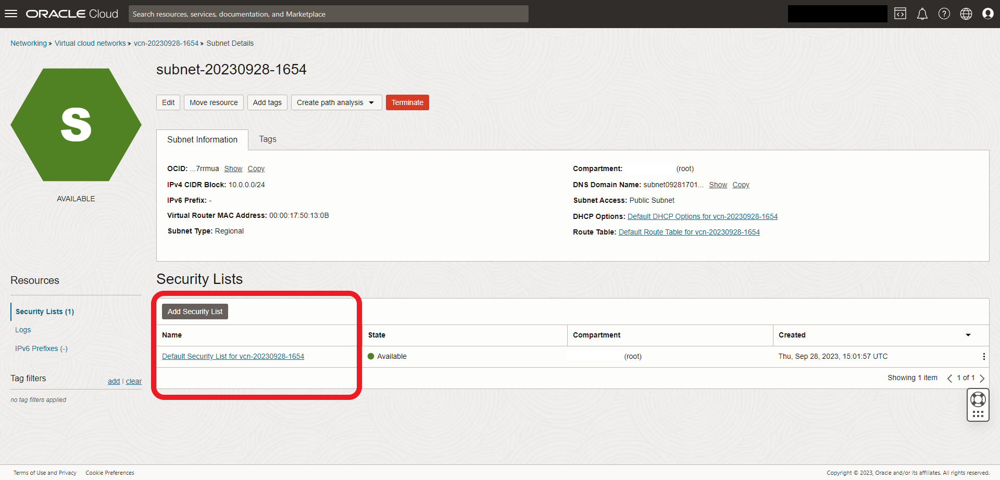
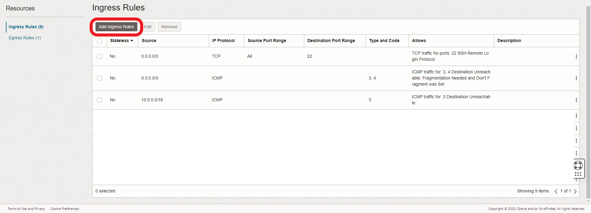
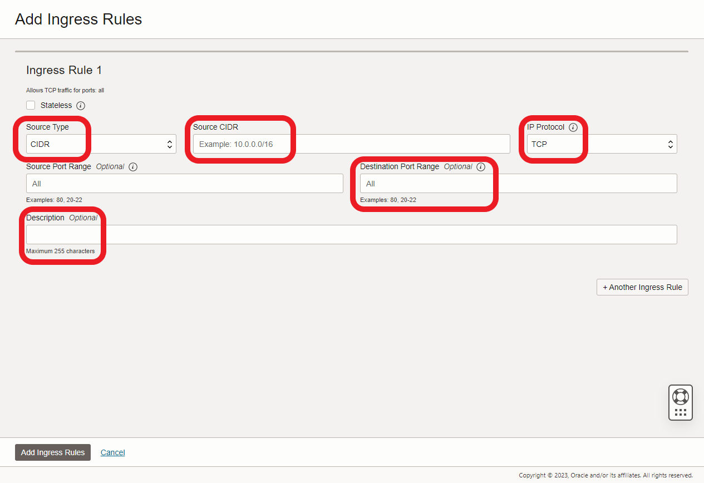

# 🚪 Change ssh port

### 1. Edit Security List on OCI

From the **OCI control panel** navigate to **Compute > Instances** and **select your instance**. You should see something like this:

<figure><figcaption></figcaption></figure>

Click on the **subnet**:

<figure><figcaption></figcaption></figure>

Next, either make a new **Security List**, or simply edit the **Default**:

<figure><figcaption></figcaption></figure>

Add a new **Ingress Rule**:

<figure><figcaption></figcaption></figure>

In the following panel enter the required information:

* **Source Type:** CIDR
* **Source CIDR:** either 0.0.0.0/0 or \<the-ip-you'll-be-connecting-from>/32
* **IP Protocol:** TCP
* **Destination Port Range:** \<the-port-you-want-to-use-for-ssh>
* **Description:** something that makes sense to you


**Please note:** DO NOT delete the default SSH (port 22) Ingress Rule at this point


<figure><figcaption></figcaption></figure>

### 2. Change SSH listening port in the daemon

Next, connect to your instance as you did [here](../connecting-to-your-instance.md) and change SSH port on the VM:

```sh
# Edit the ssh configuration file
sudo nano /etc/ssh/sshd_config

# Find the line that says #Port 22 and replace it with:
Port <the-port-you-selected-earlier>

# Save your changes and reload the daemon
sudo systemctl restart sshd
```

More details about this process can be found [here](https://www.ubuntu18.com/ubuntu-change-ssh-port/).


**Please note:** you must include the following steps for this to work in OCI


### 3. Manage ingress rules with firewalld

Install firewalld and set new rules:

```bash
# Install firewalld
sudo apt install firewalld

# Firewalld should come enabled and auto-start. In case it doesn't do:
sudo systemctl enable firewalld
sudo systemctl start firewalld

# Add the new ssh port to the public zone
sudo firewall-cmd --zone=public --add-port=<the-port-you-selected-earlier>/tcp --permanent 

# Reload firewalld rules
sudo firewall-cmd --reload

# Check that the rule stuck
sudo firewall-cmd --list-all                
```


**Please note:** before disconnecting your current session, open a new Terminal session and ssh using your new port&#x20;


```sh
# Connecting to your instance with the new port (add the -p flag)
ssh -i "<path-to-the-new-oracle-key>" -p <the-port-you-selected-earlier> <your-chosen-username>@<the-ip4-address-of-the-new-vm>
```


A couple of links regarding this process:

[Ways to manage access to OCI instances](https://stackoverflow.com/questions/62326988/cant-access-oracle-cloud-always-free-compute-http-port);

[Problems with firewalld rules](https://unix.stackexchange.com/questions/492124/setting-firewall-cmd-permanent-is-not-sticking-after-reboot);

[Controlling system access with firewalld](https://docs.fedoraproject.org/en-US/quick-docs/firewalld/);

[Opening ports to specific IPs](https://www.tutorialspoint.com/how-to-open-port-for-a-specific-ip-address-in-firewalld);

[Managing traffic with zones in firewalld](https://access.redhat.com/documentation/it-it/red\_hat\_enterprise\_linux/7/html/security\_guide/sec-using\_zones\_to\_manage\_incoming\_traffic\_depending\_on\_source).

